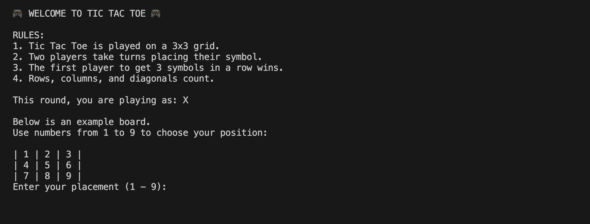

# 🎮 Tic Tac Toe — Java CLI Application

## 📌 General Info
This project is a **Tic Tac Toe** game fully developed in **Java**, designed to run in the **terminal (CLI)**.
The game supports two players (**X** and **O**) who take turns placing their moves on a **3×3** board. It validates each move, prevents invalid plays, detects win/draw conditions, and allows restarting the game after it ends.
This project was 100% developed by me as part of my journey to strengthen object-oriented programming skills and game logic implementation in Java.

---

## Table of Contents
1. [General Info](#-general-info)
2. [Screenshots](#screenshots)
3. [Technologies](#technologies)
4. [Installation](#installation)
5. [Usage](#usage)
6. [Project Status](#project-status)
7. [FAQs](#faqs)

---

## Screenshots

### Game Start


### During Gameplay


### Game Result


---

## 💻 Technologies

- Java 21
- Maven
- Git / GitHub

---

## ⚙ Installation
1. Clone the repository:
```bash
git clone https://github.com/your-username/tic-tac-toe.git
```

2. Navigate to the project folder:
```bash
cd tic-tac-toe
```

3. Compile the project:
```bash
mvn clean install
```

4. Run the application:
```bash
mvn exec:java
```
(Adjust command if needed depending on your Maven setup.)

---

## Usage

- The game starts automatically in the terminal.
- Player X always goes first.
- Enter a number between 1 and 9 to select a position.
- The system prevents playing on occupied positions.
- After each move, the game checks for:
    - Win condition
    - Draw condition
- At the end of the game, you can restart or exit.

---
## 🚀 Project Status

✔ Core gameplay implemented<br>
✔ Win/draw validation<br>
✔ Restart functionality<br>
✔ Input validation<br>
✔ Clean object-oriented structure

---

## ❓ FAQs

**Q: Is this project graphical?**<br>
No. It runs entirely in the terminal (CLI).

**Q: Was this a team project?**<br>
No. This project was fully developed by me.

**Q: What was the main goal of this project?**<br>
To practice object-oriented programming, game flow control, and logic validation in Java.